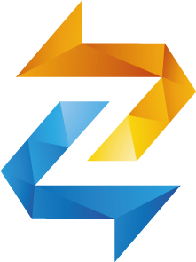

<!--
*** Hey, Welcome to ZentaChains DEX, short ZentaDex. I hope you like it :)
-->

<!-- Zenta LOGO -->
 

  

  <h3 align="center">Wellcome to ZentaDEX</h3>

  

   An Opensource Decentralized Exchange Platform From ZentaChain.
     
    <a href="https://github.com/ZentaChain/Zentadex/tree/master/dex"><strong>ZentaDEX</strong></a>
     
     
    <a href="https://github.com/ZentaChain/Zentadex/tree/master/dex">Github Docs»</a>
    ·
    <a href="https://github.com/ZentaChain/Zentadex/tree/master/dex">Report Bug</a>
    ·
    <a href="https://github.com/ZentaChain/Zentadex/tree/master/dex">Request a Change!</a>
  

<!-- ABOUT ZENTADEX -->
## About ZENTADEX
ZentaDex is not "Just Another" Dex, its an Open source fully Supported and Fast Exchange platform. You can trade every ERC-20 token over ZentaDex. the User Interface is easy to use and the Integration in our other products makes it more convenient for you! Due to the Nature of the Block-chain network your funds are secured on your own wallet, remember: not your keys not your coins. Also what are your waiting for? Trade on [ZentaDEX](http://www.zentalk.chat/) today!

Here's why:
* ZentaDEX is a full blown Exchange Plattform hostet on the Ethereum Network. Its fully integratet in ZentaChain Products  as [ZentaVault](), [Zentalk](http://www.zentalk.chat/) and [ZentaWallet]()
* We provide a secure integrated and 24/7 Supportet Platform 
* The team works Daily on Improvements and you can help :smile:

The Platform as you see is just an Addon to the whole ZentaChain Univerese. If you like you can contact us over Email , [Twitter](https://twitter.com/zentachain) or [Telegramm](https://t.me/ZentachainOfficialChat). Our Team will help you out!

<!-- LICENSE -->
## License

Distributed under the MIT License. See `LICENSE` for more information.
